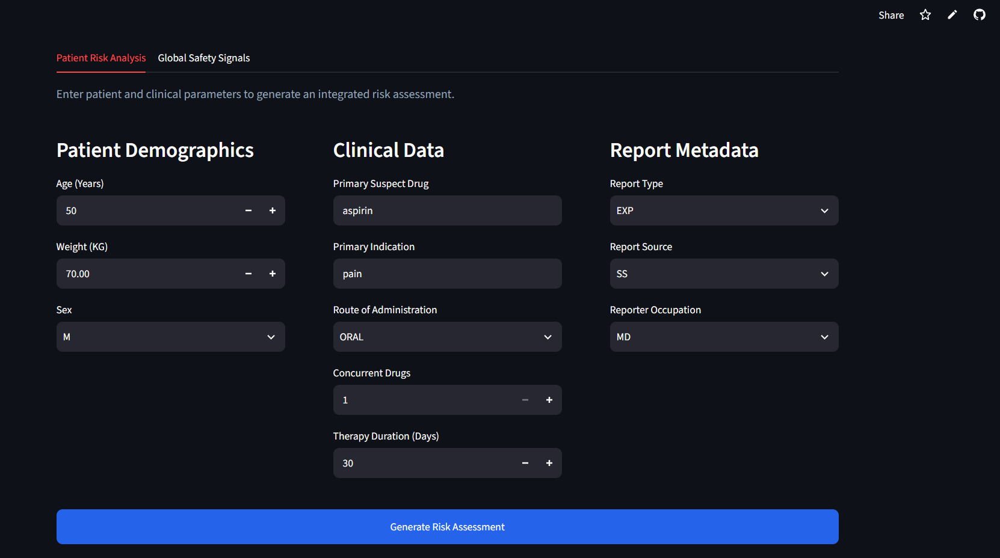
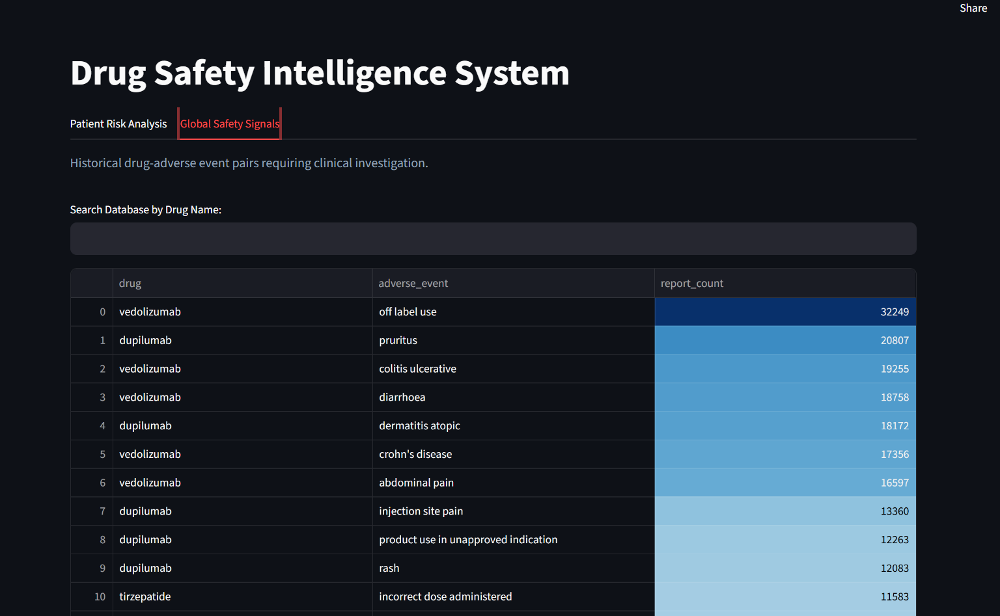
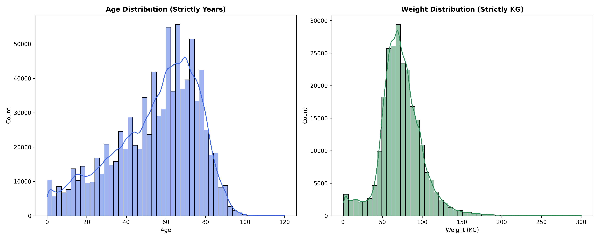
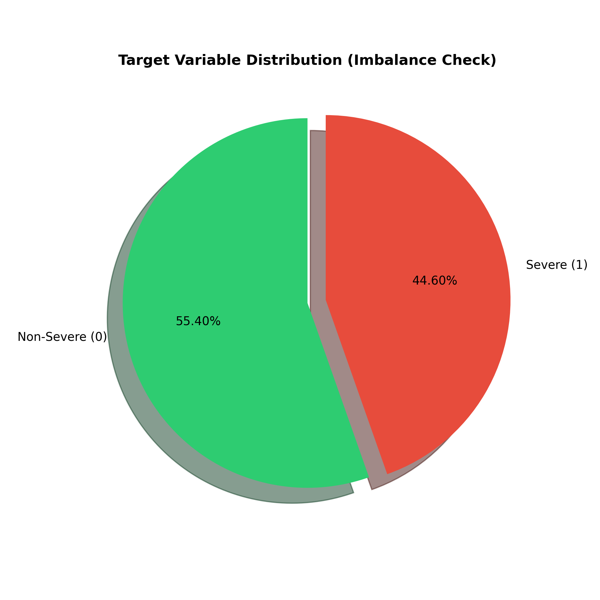
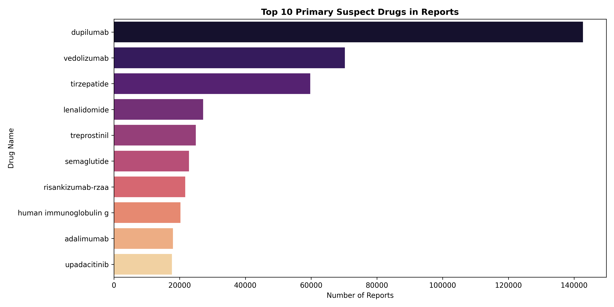
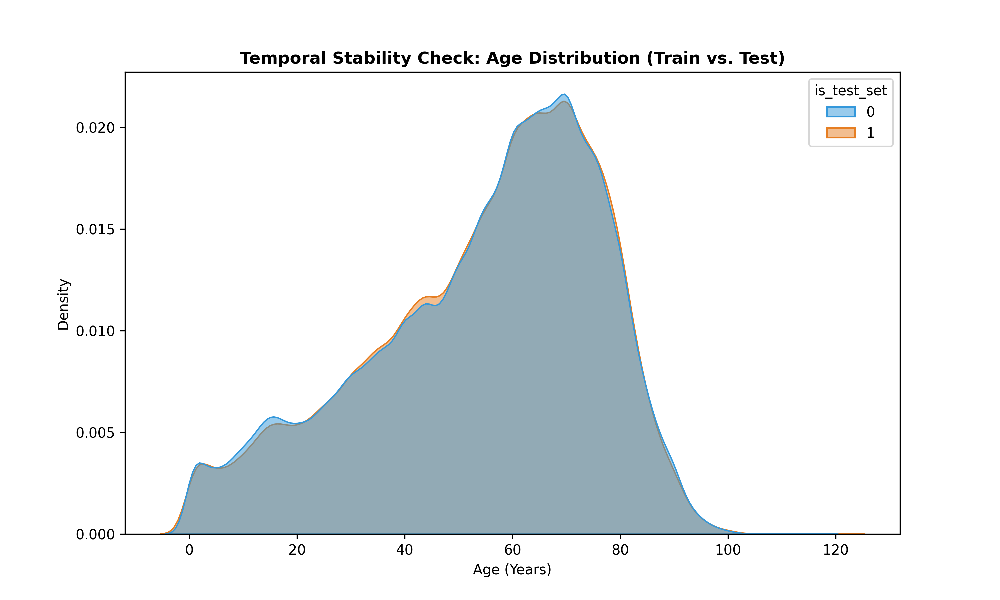

<div align="center">

# 💊 Drug Safety Intelligence System (V2.0)

### AI-Powered Pharmacovigilance, Risk Assessment & GenAI Platform

[](https://www.python.org/)
[](https://www.docker.com/)
[](https://ai.google.dev/)
[](https://fastapi.tiangolo.com/)
[](https://streamlit.io/)
[](LICENSE)

<br/>

[🌟 Overview](#-overview) • [✨ Features](#-features) • [📸 Screenshots](#-screenshots) • [🛠️ Tech Stack](#️-tech-stack) • [📦 Installation](#-installation) • [👨‍💻 Author](#-author)

---


### **Transform raw clinical data into proactive patient safety insights** ✨

<br/>

[](/)
[](/)
[](/)

</div>

---

## 🌟 Overview

The **Drug Safety Intelligence System (V2.0)** is an end-to-end, AI-powered pharmacovigilance platform. Refactored into a scalable **Microservices Architecture** using Docker, this system analyzes adverse drug events to proactively predict patient harm severity. 

In this major V2 update, the platform goes beyond traditional Machine Learning by integrating **Google's Gemini GenAI** to act as a virtual Clinical Pharmacologist, generating context-aware medical reports based on predictions.

> 🏥 **FDA FAERS Integration** - Built on massive real-world relational databases (Year 2025) including DEMO, DRUG, REAC, THER, and OUTC.

### 🎯 What Makes V2.0 Special?

<table>
<tr>
<td width="50%">

#### 🐳 Microservices Architecture
Fully containerized using **Docker Compose**, separating the frontend UI (Streamlit) from the backend API (FastAPI) for maximum scalability.

#### 🤖 GenAI Clinical Reports
Integrates **Google Gemini 3.6-Flash** to digest patient data and ML predictions, automatically writing professional, actionable clinical advice.

#### 🧠 Advanced ML Models
Utilizes highly optimized **XGBoost** models for both Binary Severity Prediction (ROC-AUC: 85.08%) and Multi-class Reaction Forecasting.

</td>
<td width="50%">

#### ⚡ Automated CI/CD Pipeline
Integrated with **GitHub Actions** for continuous integration, automatically enforcing linting and verifying Docker builds on every push.

#### ⚖️ Class Imbalance Handling
Programmatically tackles real-world clinical data imbalance using strategic downsampling and rigorous Target/Mean Encoding strategies.

#### ☁️ Cloud-Optimized
Refactored from a massive 2GB ensemble to a streamlined **~53MB `joblib`-compressed model**, perfect for strict memory environments.

</td>
</tr>
</table>

---

## ✨ Features

### 📱 Core Modules

<table>
<tr>
<td align="center" width="33%">

<br/><strong>🔬 Patient Risk Analysis</strong>
<br/><sub>Calculates real-time severity probabilities based on patient profiles</sub>
</td>
<td align="center" width="33%">

<br/><strong>🤖 AI Pharmacologist</strong>
<br/><sub>Generates actionable medical advice using Google Gemini GenAI</sub>
</td>
<td align="center" width="33%">

<br/><strong>🔮 Reaction Forecasting</strong>
<br/><sub>Predicts the top 3 adverse events a patient might experience</sub>
</td>
</tr>
<tr>
<td align="center">

<br/><strong>🚨 Signal Detection</strong>
<br/><sub>Interactive database exploring historical drug-reaction reports</sub>
</td>
<td align="center">

<br/><strong>⚡ Oriva PV API</strong>
<br/><sub>Containerized FastAPI endpoints for seamless external integration</sub>
</td>
<td align="center">

<br/><strong>📈 Deep EDA Reports</strong>
<br/><sub>High-res clinical pattern visualizations and data drift checks</sub>
</td>
</tr>
</table>

### 🤖 Machine Learning Capabilities

| Task | Algorithm | Optimization | Performance (Test Set) |
|:-----|:----------|:-------------|:-----------------------|
| 🔴 **Severity Prediction** | `XGBClassifier` (Binary) | `scale_pos_weight=1.40`, `tree_method='hist'` | **ROC-AUC: 85.08%**<br>Recall: 77.00% |
| 💊 **Reaction Forecasting** | `XGBClassifier` (Multi-class) | `max_depth=10`, `compress=9` (~53MB footprint) | **Accuracy: 72.85%**<br>(Across 20 targets) |

---

## 📸 Screenshots

<div align="center">

### 💻 Live System Dashboard

<table width="100%">
<tr>
<td align="center" width="50%"><strong>Patient Risk Analysis & GenAI</strong></td>
<td align="center" width="50%"><strong>Global Safety Signals Database</strong></td>
</tr>
<tr>
<td align="center"></td>
<td align="center"></td>
</tr>
</table>

### 📊 Deep Exploratory Data Analysis (EDA)

<table width="100%">
<tr>
<td align="center" width="33%"><strong>Demographics (Age/Weight)</strong></td>
<td align="center" width="33%"><strong>Target Imbalance</strong></td>
<td align="center" width="33%"><strong>Top 10 Suspect Drugs</strong></td>
</tr>
<tr>
<td align="center"></td>
<td align="center"></td>
<td align="center"></td>
</tr>
<tr>
<td align="center" colspan="3"><strong>Temporal Stability (Data Drift)</strong></td>
</tr>
<tr>
<td align="center" colspan="3"></td>
</tr>
</table>

</div>

---

## 🛠️ Tech Stack

<div align="center">

### Deployment & DevOps
| Technology | Purpose |
|:----------:|---------|
|  | Containerization & Microservices Orchestration |
|  | CI/CD Pipeline (Linting & Build Tests) |

### Backend, AI & ML
| Technology | Purpose |
|:----------:|---------|
|  | High-performance RESTful API |
|  | LLM for Clinical Report Generation |
|  | Tree-based Classification Algorithms |

### Frontend & Data
| Technology | Purpose |
|:----------:|---------|
|  | Interactive Web Dashboard |
|  | Clinical Data Manipulation |

</div>

---

## 📦 Installation (Dockerized)

<details>
<summary><strong>📋 Prerequisites</strong></summary>

- ✅ Docker & Docker Compose installed
- ✅ Git installed
- ✅ Google Gemini API Key

</details>

### 🚀 Quick Start

The system is fully containerized. You can launch the entire stack (Frontend + Backend) with a single command.

```bash
# 1️⃣ Clone the repository
git clone [https://github.com/GoldenBoy13420/Drug-Safety-System-V2.git](https://github.com/GoldenBoy13420/Drug-Safety-System-V2.git)
cd Drug-Safety-System-V2
```

**2️⃣ Setup Environment Variables**  
Create a `.env` file in the root directory and add your Gemini API Key:

```env
GEMINI_API_KEY=your_actual_api_key_here
```

**3️⃣ Build and Run the Microservices**  

```bash
docker-compose up --build
```

**4️⃣ Access the System**  

- **Frontend Dashboard:** `http://localhost:8501`
- **Backend API Docs (Swagger):** `http://localhost:8000/docs`

---

## 📁 Project Structure (V2.0)

```text
DRUG-SAFETY-SYSTEM-V2/
│
├── 📂 backend/                 # API & AI Microservice
│   ├── 📂 models/              # Compressed XGBoost .pkl models & Encoders
│   ├── main.py                 # FastAPI Endpoints & GenAI Logic
│   ├── Dockerfile
│   └── requirements.txt
│
├── 📂 frontend/                # UI Microservice
│   ├── 📂 reports/             # Safety Signals & EDA Figures
│   ├── app.py                  # Streamlit Dashboard
│   ├── Dockerfile
│   └── requirements.txt
│
├── 📂 .github/workflows/       # CI/CD pipelines (ci.yml)
├── 🐳 docker-compose.yml       # Microservices orchestrator
└── 📄 .gitignore               # Security & Cache exclusions
```

---

## 👨‍💻 Author

<div align="center">


### **Mahmoud Abdelrauf**
*AI & Software Engineer | Pharmacovigilance Systems Developer*

<a href="https://github.com/GoldenBoy13420">

</a>

</div>

---

## 📜 License

This project is licensed under the [MIT License](LICENSE).

---

## ⭐ Support

If you find this AI intelligence architecture helpful, please give it a star!